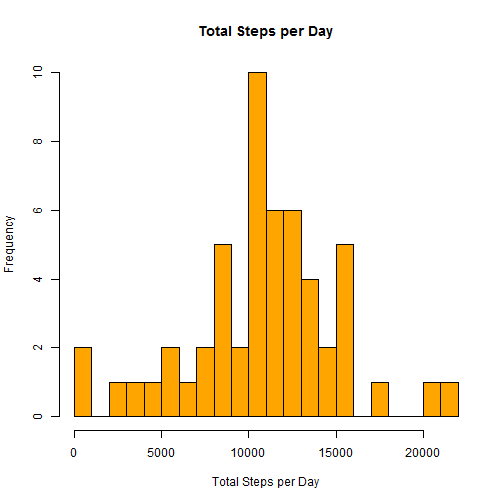
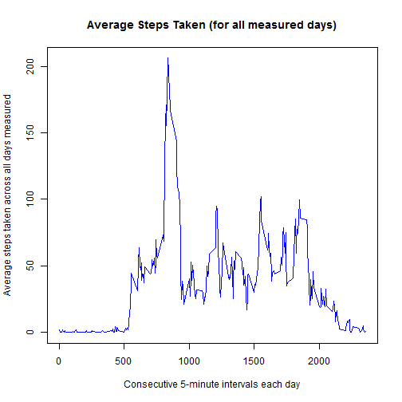
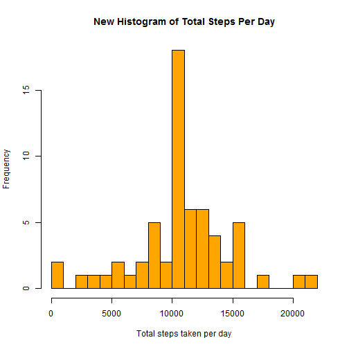

<!-- Reproducible Research: "Peer Assessment 1" (Assignment 1 Week 2 July 2015 -->
<!-- The data was downloaded and stored into my local working directory -->

---
title: "Reproducible Research: Peer Assessment 1"
output: 
  html_document:
    keep_md: true
---

## Loading and preprocessing the data
#### Load Required Libraries 
#### Set Global Options 
#### Set Local Working Directory
#### Read in Data file from the Local Working Directory


```r
library(ggplot2)
library(lattice)
library(stats)

options(scipen = 1) # This line of code removes default scientific notation options

setwd("C:/Users/E121977/Desktop/Coursera - Data Science/(5) Reproducible Research/RepData_PeerAssessment1/")

data <- read.csv("activity.csv")
```


## What is mean total number of steps taken per day?


```r
hist(tapply(data$steps, data$date, sum), xlab = "Total Steps per Day", breaks = 20, main = "Total Steps per Day", col = "orange")
```

 


```r
mean.steps <- round(mean(as.numeric(tapply(data$steps, data$date, sum)), na.rm = TRUE),2)
```


```r
median.steps <- round(median(as.numeric(tapply(data$steps, data$date, sum)), na.rm = TRUE),2)
```

_**The mean number of steps taken per day is 10766.19**_  
_**The median number of steps taken per day is 10765**_

## What is the average daily activity pattern?


```r
data.interval.aggregated <- aggregate(steps~interval, data = data, FUN = function(x) c(mean = mean(x)))

plot(steps~interval, data = data.interval.aggregated, type = "l",
     main = "Average Steps Taken (for all measured days)",
     xlab = "Consecutive 5-minute intervals each day",
     ylab = "Average steps taken across all days measured",
     col = "blue")
```

 


```r
data.most.active.interval <- data.interval.aggregated$interval[which(data.interval.aggregated$steps == max(data.interval.aggregated$steps))]

max.average.steps <- round(max(data.interval.aggregated$steps),1)
```


_**The average maximum number of steps taken (206.2) occurs during the 5-minute interval starting at the 835th minute of each daily cycle.  NOTE: Each daily 5 min cycle begins at "0" and ends at "2055".**_ 

## Imputing missing values

#### Calculate and report the total number of missing values (NA) in the dataset.

```r
missing.values <- dim(data[!complete.cases(data),])[1]
```
_**The total number of missing values in the dataset represented by "NA" is 2304 **_

#### Create a strategy for populating all missing values
The strategy selected to replace all missing values is to replace the "NA" values in the occurance with the mean value for each interval.

#### Create a new data set populating all missing values


```r
# Copies dataset before modifying
data.newdata <- data

# Fills in empty step data with mean for a given interval.
for (row in which(is.na(data.newdata$steps))) {
    data.newdata$steps[row] <- as.numeric(data.interval.aggregated[data.interval.aggregated$interval == data.newdata$interval[row],]["steps"])
}

# Aggregates steps by date.
data.newdata.aggregated <- aggregate(steps ~ date, 
                                      data = data.newdata, 
                                      FUN = function(x) c(sum = sum(x)))
```

#### Make a histogram on new data set.


```r
# Shows the results.
hist(data.newdata.aggregated$steps, 
     main = "New Histogram of Total Steps Per Day",
     xlab = "Total steps taken per day",
     col = "orange",
     breaks=20)
```

 

####  Report the mean and median total number of steps taken each day.  


```r
new.mean.steps <- round(mean(as.numeric(tapply(data.newdata$steps, data.newdata$date, sum)), na.rm = TRUE),2)
```


```r
new.median.steps <- round(median(as.numeric(tapply(data.newdata$steps, data.newdata$date, sum)), na.rm = TRUE),2)
```

_**The new mean number of steps taken per day is 10766.19 **_

_**The new median number of steps taken per day is 10766.19**_

_**The new mean and median of the total number of steps per day after filling in the NA values with the mean of the existing population is 10766.19 and 10766.19, respectively. Note that the values are the same, and different from the original data set.  This is the result fo filling in the NAs in this data set with mean values of the existing smaller population of known values. If we had chosen a different method, the mean and median would have generated different results but moist likely consistent values. **_

## Are there differences in activity patterns between weekdays and weekends?

#### Create a new factor variable in the dataset with two levels -- "weekday" and "weekend" indicating whether a given date is a weekday or weekend day.


```r
# Using the original dataset, determine if a given day name is on the weekend or not.
day.type <- function(day.of.week) {
    if (day.of.week == "Saturday" || day.of.week == "Sunday") {
        return("weekend")
    } else {
        return("weekday")
    }
}

# Create a list of day types to add to the dataset.
day.factor <- sapply(weekdays(as.Date(data.newdata$date)), FUN = day.type)

# Add the new factor to the dataset.
data.newdata$day <- factor(day.factor)

avgSteps <- aggregate(data.newdata$steps, list(interval = as.numeric(as.character(data.newdata$interval)), day = data.newdata$day), FUN="mean")
names(avgSteps)[3] <- "meanOfSteps"
```

#### Make a panel plot containing a time series plot (i.e. type = "l") of the 5-minute interval (x-axis) and the average number of steps taken, averaged across all weekday days or weekend days (y-axis).  


```r
xyplot(avgSteps$meanOfSteps ~ avgSteps$interval | avgSteps$day, layout = c(1,2), type = "l", xlab = "Interval", ylab = "Number of Steps")
```

 


_**The short answer is yes, there are differences in activity bewteen the two types of days.**_

_**Comments:  The new mean and median of the total number of steps per day after filling in the NA values with the mean of the existing population is 10766.19 and 10766.19, respectively. Note that the values are the same, and different from the original data set.  The amount of activitiy spikes earlier in the day for a weekday but appears to fluctiuate more thoughout a weekend day with a larger amount of total activity in thes two days compared top the amount of activity during a 5 day weekday peroid during the same 5 min time intervals.  This could be the result of missing data being populated into the weekend days more than the weekdays.  More analysis would be required to determine actual cause and effect. Since the steps recorded are for a full 24 hour cycle populating all NA with values also produces an undesirable skew of measured data.  The more desirable approach should have been to populate the data file where NA existed with zero values to better understand actual activity.**_

